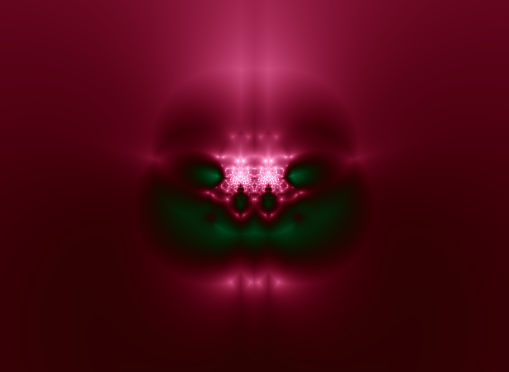

# steggo

Encodes the context of a text file into a png image.

Decodes that data back out of the image.

## Dependencies:

- go 1.16
- go-cairo `go get github.com/bit101/go-cairo`

## Build: 

    `go build`

## Install:

Move the `steggo` executable to somewhere in your path.

## Usage:

    # encode a data file into an image
    steggo encode -i input.png -o encoded.png -d datafile.txt 

    # encode text from the command line into the image
    steggo encode -i input.png -o encoded.png -t "some text" 

    # decode text from an image, dumping to the console
    steggo decode -i encoded.png

    # decode text from an image, dumping to a file
    steggo decode -i encoded.png -o recovered.txt

## Notes:

This project is for educational purposes only. It is not supported in any way. Use at your own risk.

Only built and tested on Linux.

## Concepts:

Encoding data into a file is done by going through the red, green and blue channels of each pixel in an image and shifting the values as needed to be even or odd. An even value represents a 0 bit. An odd value represents a 1 bit. 

Each character in the input file uses 8 bits (ascii only), plus one signal bit. The alpha channel is not used and is forced to be 255, or fully opaque. Otherwise alpha channel premultiplication messes with the RGB channels and corrupts the data.

Thus, each character uses 3 pixels worth of data.

The 9th signal bit indicates whether the data is complete or not. If there is more data to write, this is set to be even. If there is no more data, it is set to be odd.

Decoding is just the reverse. The program reads each channel of each pixel, skipping the alpha channels. If the value is even, it is interpreted as a 0. If odd, it is interpreted as a 1. Eight bits are read and turned into an ascii character and added to the overall message. If the 9th bit is even, it will read the next chunk. If it's odd, it stops. 

Since each channel of each pixel is only changed by a maximum of 1 unit (out of 256), it is effectively invisible in the output image. Of course, various types of image filters and manipulation may bring out the artifacts to a greater or lesser degree (and destroy the data in the process).

Using this method, a 100x100 pixel can hold 3,750 characters. 100 * 100 * 3 channels / 8 bits = 3,750. A full 4k image could almost hold all the text in War and Peace (over 3 million characters). In fact, I've done just this and it worked perfectly. See samples below. Encoding War and Peace takes about 5 seconds on my machine. Decoding less than half a second.

I'm using this for computer generated images, to store the parameters used to make the image. So I can pull the parameters back out later and recreate that image.

I guess you could also use it to send secret messages around, but be sure to encrypt the message before you embed it in an image. The only thing keeping anyone from reading messages in an image created this way is that people might not think to look for them.

## Sample:

These files are a bit larger than full 4K images. Big enough to hold the entire text of War and Peace.

Base Image:

Data:
[War and Peace](https://www.gutenberg.org/files/2600/2600-0.txt)

Encoded Image:

Diff of the two images, massively enhanced to show the changes:

Enhanced by cranking up the brightness and contrast as much as possible. Without that, you can see no trace of the data even in the diffed image.
